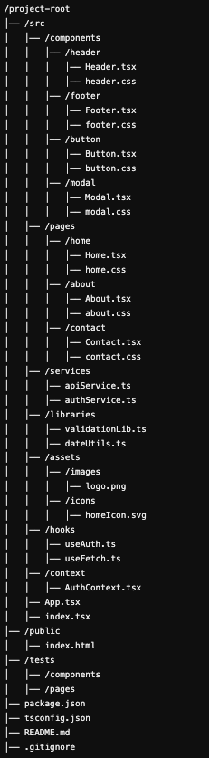

# Download as zip(dont clone) and use

# Libraries/Frameworks/Language
This project structure/template majorly uses the followings
* `React` as ui library
* `Tailwind CSS` as css utilities
* `PrimeReact` as ui component library
* `Zustand` for state management
* `Tanstack Query` for asynchronous state management
* `Typescript` as language
* `Vite` as build tool
* `Framer` for animation
* `React router` for routing
* `Saas` for theme customization

# Theming
Use Saas to build own custom theme.

## Have your own theme
* Go to `theming/themes/your_preferred_theme_or_copy/variation_like_light_dark_then_blue_or_yellow/theme.css`
* Modify as per your need
* Build by `npm run buildMyTheme`. Make sure you have seen the script item in `package.json` and updated(if really required).
* Don't put inline styles for **PrimeReact** components, Change theme or use custom css instead.

# Project structure
* `src` have all the source codes
* `src/components` is for all the **components**
* `src/pages` is for all the **pages**
* If any component have multiple files like `MyComponent.tsx`, `myComponent.css`, etc then they should be inside a dedicated folder. It means the folder structure will be like below:
* `src/components/myComponent/MyComponent.tsx`
* `src/components/myComponent/myComponent.css`
* It is best practice to put every component and page inside a dedicated folder, because with time every component/page will have more parts(files).
* `src/services` for various **services**
* `src/libraries` for various **libraries**

/project-root
│── /src
│   │── /components
│   │   │── /header
│   │   │   │── Header.tsx
│   │   │   │── header.css
│   │   │── /footer
│   │   │   │── Footer.tsx
│   │   │   │── footer.css
│   │   │── /button
│   │   │   │── Button.tsx
│   │   │   │── button.css
│   │   │── /modal
│   │   │   │── Modal.tsx
│   │   │   │── modal.css
│   │── /pages
│   │   │── /home
│   │   │   │── Home.tsx
│   │   │   │── home.css
│   │   │── /about
│   │   │   │── About.tsx
│   │   │   │── about.css
│   │   │── /contact
│   │   │   │── Contact.tsx
│   │   │   │── contact.css
│   │── /services
│   │   │── apiService.ts
│   │   │── authService.ts
│   │── /libraries
│   │   │── validationLib.ts
│   │   │── dateUtils.ts
│   │── /assets
│   │   │── /images
│   │   │   │── logo.png
│   │   │── /icons
│   │   │   │── homeIcon.svg
│   │── /hooks
│   │   │── useAuth.ts
│   │   │── useFetch.ts
│   │── /context
│   │   │── AuthContext.tsx
│   │── App.tsx
│   │── index.tsx
│── /public
│   │── index.html
│── /tests
│   │── /components
│   │── /pages
│── package.json
│── tsconfig.json
│── README.md
│── .gitignore

